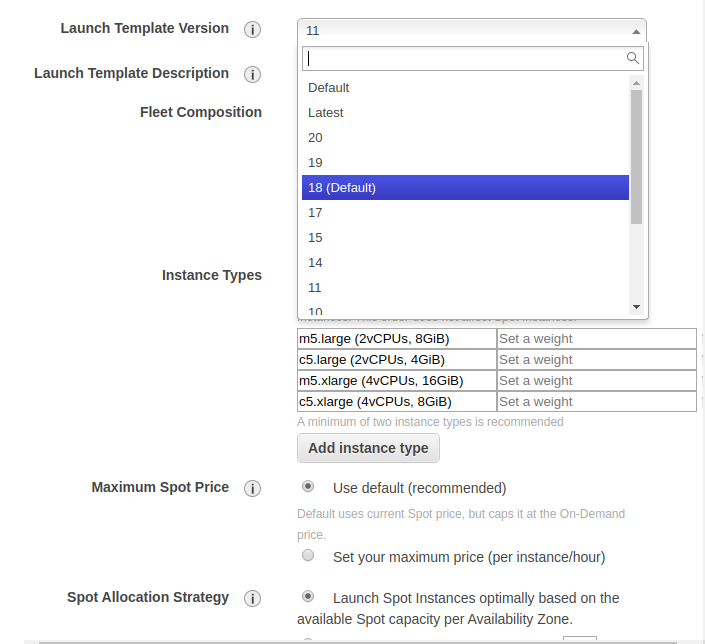
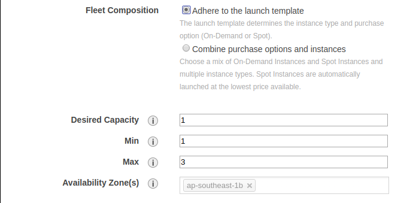
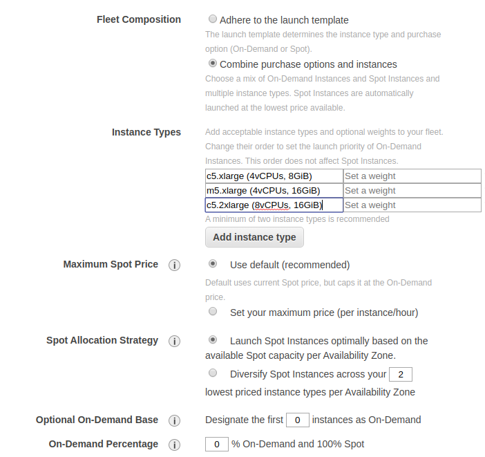

# Feel the power of AutoScaling and Spot Instances

ဒီသင်္ကြန်ပိတ်ရက်မှာ အပြင်လည်းမထွက်ရတော့ ပျင်းပျင်းနဲ့ ဂိမ်းဆာဗာလေးတစ်ခုလုပ်ဖို့ စဉ်းစားမိရင်ကနေ ကိုယ့်ပိုက်ဆံနဲ့ကိုယ်လုပ်မှာဆိုတော့ တွက်ချေလည်းကိုက်ရမယ် Server ကိုလည်း [**Uptime 99.5%** ](https://uptime.is/99.5) ****လောက်ပေးချင်တယ်ဆိုပြီး Infra ပိုင်းလေးနည်းနည်းစဉ်းစားကြည့်ပြီး လုပ်ဖြစ်တာလေးကို ဝေမျှလိုက်ရပါတယ်။ 

ဒီနေရာမှာ ကျွန်တော့်အနေနဲ့ က လိုအပ်တာတွေရှိတယ်။ အဲ့ဒါတွေကို အရင်စဉ်းစားလိုက်တယ်။ ဘာလိုမလဲဆိုရင် ထုံးစံအတိုင်း အရင်ဆုံး Infrastructure requirement  အရ Virtual Private Cloud \( VPC \) တစ်ခုကို Public / Private Subnets တွေနဲ့ တည်ဆောက်လိုက်တယ်။ Public / Private Subnets ဆောက်တာက ဘာအတွက်လဲဆိုတော့ အရင်ဆုံးဘာမှမရှိသေးတဲ့ Infrastructure မှာ Network လိုလို့ပါ။ Network Diagram အရဆိုရင်တော့ အောက်မှာပြထားတဲ့ပုံထဲကလိုမျိုးပေါ့ဗျာ ။ ပြီးတော့ Web Server နဲ့ Application Server အပြင် ကျွန်တော်သုံးချင်တဲ့ထဲမှာ Database Server တစ်ခုသုံးဖို့လိုလို့။ Best Practices ဆိုတာထပ်လည်း Database Server လိုမျိုးက Public Subnet မှာမထားသင့်ထဲမှာပါတယ်။  Best Practices အရလည်း အဆင်ပြေတယ်။  အဆင်မပြေတာက တစ်ခုပဲ။ ဘာလဲဆိုတော့ NAT Gateway အတွက်ပိုက်ဆံထပ်ကုန်တာပါ။ အဲ့နေရာမှာ Private Subnet က Internet ကို ထွက်ဖို့အတွက် [**NAT Gateway**](https://docs.aws.amazon.com/vpc/latest/userguide/vpc-nat-gateway.html#nat-gateway-basics) လိုတယ်။ ဒီနေရာမှာ စျေးသက်သာချင်ရင် Web , App, Database သုံးခု စလုံးကို Public Subnet မှာထားပြီးလုပ်လိုက်ရင်လည်း အဆင်ပြေတယ်။ အဲ့ကြရင် NAT Gateway ဖိုးမကုန်တော့ဘူး။ ဘယ်လိုမှဖြစ်မယ်ဆိုတာမျိုးတော့ မရှိပါဘူး ။ 


ကျွန်တော်ကတော့ Web နဲ့ Application Server ကို Public Subnet မှာထားပြီးတော့ Database ကိုတော့ Private Subnet ထဲပို့လိုက်တယ်။ VPC Setup ပြီးပြီဆိုရင်တော့ ကျွန်တော်တို့လိုချင်တဲ့ Game Server လုပ်ဖို့ Compute Instances \( EC2 \) ဘက်အပိုင်းကိုသွားလိုက်ရအောင်။  ကိုယ်သုံးချင်တဲ့  Tier ပုံစံကို တစ်ခုထပ်စဉ်းစားဖို့လိုပါမယ်။ ဘယ်ဟာကို ဘယ်လိုထားမှာလဲ 2 Tier လား 3 Tier လား ၊ ဘယ်နေရာမှာ ဘာသုံးမယ် စသည်ဖြင့်ပေါဗျာ။ ကျွန်တော်ကတော့ Web, App, Database သုံးခုမှာ Web နဲ့ App ကို Instance တစ်ခုတည်းသုံးလိုက်တယ်။ ပိုက်ဆံကုန်သက်သာအောင်လို့ပါ ;\)  Database Server ကိုတော့ AWS ရဲ့ Managed RDS ကိုမသုံးတော့ဘူး ဒီနေရာမှာ ကိုယ်တိုင် EC2 ကို Setup လုပ်ပြီး Manage လုပ်ပါမယ်။ အဲတော့ စုစုပေါင်းမှ EC2 Instance ၂ ခုပဲလိုပါတယ်။ 

အိုကေ အဲ့တော့ Application Server အတွက် အမြဲတမ်း Run နေအောင် နဲ့ အကုန်အကျလေးတော်တော်သက်သာအောင် EC2 AutoScaling နဲ့ Spot Instance ကိုတွဲသုံးပါမယ်။ အပေါ်မှာပြောခဲ့သလို ပဲ Uptime က 99.5% ရှိနေရမှာဖြစ်တဲ့အတွက် Server ကတစ်ခုခုဖြစ်သွားရင် ချက်ချင်းဆိုသလိုပြန်တက်လာပြီး Up and Running ဖြစ်နိုင်ဖို့ လိုပါတယ်။ အဲ့အတွက် AWS ရဲ့ [**EC2 Auto Scaling** ](https://aws.amazon.com/ec2/autoscaling/) သုံးရတာပါ။  စျေးသက်ဖို့အတွက်  နောက်တစ်ခုက [**EC2 Spot Instance**](https://aws.amazon.com/ec2/spot/) ပါ။ Spot Instance အကြောင်းကို အောက်က လင့် မှာလည်းလေ့လာလို့ရပါတယ်။ 




သူကတော့ EC2 Instance ရဲ့ Purchase Option တစ်ခုပါ ပုံမှန် Instance \( On-demand \) ထပ်များသောအားဖြင့် Average စျေးက 60-70% လောက်သက်သာပါတယ်။ နောက်တစ်ခုလိုအပ်တာကတော့ [**Elastic IP**](https://docs.aws.amazon.com/AWSEC2/latest/UserGuide/elastic-ip-addresses-eip.html#eip-basics) ပါ။ သူကတော့ Auto Scaling မှာ EC2 Instance က တစ်ခုခုဖြစ်ပြီး Down သွားရင်သော်လည်းကောင်း Spot Instance နဲ့တွဲသုံးမှာဖြစ်တဲ့အတွက် Spot Instance ရဲ့ သဘောတရားအရ Spare Resource တွေမလောက်တော့ရင်ဖြစ်ဖြစ် ကိုယ့် EC2 Instance ကပျက်သွားမှာပါ။ အဲ့ဒီအခါကြရင် Auto Scaling နဲ့ EC2 Instance အသစ်တစ်ခုပြန်တက်လာတဲ့ အခါမှာ အရင်ကရှိခဲ့တဲ့ EC2 Instance ရဲ့ IPv4 IP Address ကပျက်သွားပြီးတော့ IP Address အသစ်တစ်ခုနဲ့ပြန်တက်လာမှာပါ။


 ဒီမှာ ပြဿနာက အရင် EC2 Instance ရဲ့ IP Address ကသာ Domain နဲ့တွဲထားမယ်ဆိုရင် Instance အသစ်ပြန်တက်လာတဲ့အခါ်မှာ IP ပြောင်းသွားတဲ့အတွက် Access လုပ်တဲ့အခါမှာ အခက်တွေ့စေမှာဖြစ်ပါတယ်။ 


Elastic IP သုံးထားတဲ့အတွက် Auto Scaling Group မှာ EC2 Instance က အပေါ်မှာပြောခဲ့တဲ့ Case တစ်ခုခုကြောင့်က Down သွားတယ်ဆိုရင် အသစ်တက်လာမဲ့ EC2 Instance မှာ Elastic IP က auto assign လုပ်သွားမှာဖြစ်တဲ့အတွက် စိတ်ပူစရာမလိုတော့ပါဘူး။ ထပ်ဆောင်းပြောရရင် ကျွန်တော်တို့ အခု use case မှာဆိုရင် Spot Instance သုံးထားတဲ့အတွက် ပိုတောင်လိုအပ်ပါသေးတယ်။ အခုဆိုရင် လိုအပ်တွေရပြီဆိုတော့ Web/App Server အတွက် EC2 Spot Instance ကို Auto Scaling အသုံးပြုပြီး တည်ဆောက်ပါမယ်။ 

Auto Scaling Group သုံးပြီး EC2 Instance တည်ဆောက်တဲ့အခါမှာ ရေရှည်အတွက် အဆင်ပြေအောင် [**Launch Template**](https://docs.aws.amazon.com/AWSEC2/latest/UserGuide/ec2-launch-templates.html) လေးတစ်ခုပါ create လုပ်လိုက်ပါတယ်။ Launch Template ဆိုတာကတော့ အလွယ်ပြောရရင် VM Template ပေါ့ဗျာ။ ဘာတွေပါမယ် ဘယ်လိုလုပ်မယ်ဆိုတာကြိုတင် Define လုပ်ထားလို့ရတယ်။ သူကတော့ Auto Scaling နဲ့တွဲသုံးဖို့ပါ။ Auto Scaling Group က Instance တွေအတွက် ဘယ် Image \(  AMI \) ကိုသုံးမယ် Security Group \( SG \) ကဘာထားမယ် ဘယ် Instance size သုံးမယ် ဆိုတာမျိုးတွေကိုပေါ့။ ဒီအတိုင်း EC2 Instance ကို Create လုပ်ပြီး စိတ်ကြိုက်လိုတာတွေသွင်းပြီမှ Launch Template ကိုပြန်ပြီး create လုပ်လို့လည်းရပါတယ်။ Auto Scaling Group အတွက် Launch Template တစ်ခုဘယ်လို create လုပ်လဲဆိုတာကိုတော့ အောက်ကလင့်မှာလေ့လာနိုင်ပါတယ် ။ 


[https://docs.aws.amazon.com/autoscaling/ec2/userguide/create-launch-template.html](https://docs.aws.amazon.com/autoscaling/ec2/userguide/create-launch-template.html)


ဒီမှာနောက်ထပ်တစ်ခုရှိတာက Auto Scaling Group ကို Launch Template နဲ့မဟုတ်ပဲ [**Launch Configuration**](https://docs.aws.amazon.com/autoscaling/ec2/userguide/LaunchConfiguration.html) ဆိုတာနဲ့လည်းတွဲသုံးလို့ရတယ်ဆိုတာပါပဲ။ ဒါပေမယ့် Launch Template ကပိုလုပ်လို့ရပါတယ်။ ဆိုလိုတာက Launch Template မှာ များများပိုကလိလို့ရတယ်။ အဓိကအားသာတာ တစ်ခုကတော့ Launch Template က Versioning လုပ်လို့ရတာပဲ။ 


Versioning လုပ်လို့ရတဲ့ အတွက် ကျွန်တော်တို့ အခု use case အတွက်လည်းတော်တော်အဆင်ပြေပါတယ်။ 

Launch Template ကို create လုပ်ပြီးရင်တော့  Auto Scaling Group ကို Spot Instance နဲ့ စတင် create လုပ်လို့ရပါပြီ။ Launch Template ထဲမှာတော့ ကျွန်တော်တို့က EC2 Instance ကိုဘယ် Subnet မှာထားမယ်ဆိုတာတွေကို Define မလုပ်ခဲ့တဲအတွက် Auto Scaling Group မှာ Define လုပ်ရပါမယ်။ 


/App Server နဲ့ Database Server ကို Same Subnet မှာထားရင် Latency မဆိုသလောက်နည်းနည်းလေး ရှိတဲ့ issue ကိုအဆင်ပြေနိုင်ပါတယ်။ Same Subnet ဆိုတာထပ် Same Availability Zone \( AZ \) တူတူထားတာကို ပြောတာပါ။ AZ မတူရင်ဘာဖြစ်လဲဆိုတော့ Millisecond latency မှာသိသာပါတယ်။  




နောက်တစ်ခုက Launch Template မှာ EC2 Instance Type တွေကို Define လုပ်ခဲ့ပေမယ့် Auto Scaling ရောက်မှလည်း  Define လုပ်လို့လည်းရသလို Override လုပ်လို့လည်းရပါတယ်။ နောက်ထပ် Instance Type တွေလည်းထပ်ထည့်လို့ရပါတယ်။  Option 1 ကတော့ Launch Template မှာ Define လုပ်ခဲ့တဲ့ Instance Type အတိုင်းသုံးမှာပါ။ Option 2 ကတော့ စိတ်ကြိုက်ဖန်တီးလို့ရတဲ့ Option ပေါ့။ နောက်ထည့် Instance အသစ်တွေပြောင်းတာ တွေဘာတွေ အတွက်အသုံးတည့်ပါတယ်။ ကျွန်တော်ကတော့ Option 2 နဲ့ရွေးလိုက်ပါတယ်။ 

#### Option 1



#### Option 2



Auto Scaling Group ကို Create လုပ်ပြီးပြီဆိုရင်တော့ ကိုယ့်ရဲ့ Desire Capacity အလိုက် EC2 Instance တွေကို create လုပ်သွားပါလိမ့်မယ်။ 

ကျွန်တော်တို့က Auto Scaling ကို Spot Instance သုံးထားတဲ့ အတွက် EC2 Instance က Spot Instance ကိုသူ့ဘာသူတည်ဆောက်ပေးသွားမှာပါ။ AWS Console ထဲက Spot Request ဆိုတဲ့ Tab မှာသွားကြည့်လို့ရပါတယ်။ 


ဒါဆိုရင်တော့ Auto Scaling Group အကူအညီနဲ့ Spot Instance ကို တည်ဆောက်လို့ပြီးပါပြီ ။ ဒီထိအပြီးမှာ ဘာဖြစ်မလဲဆိုတော့ အပေါ်မှာပြောခဲ့သလို ASG သုံးထားတာဖြစ်တဲ့ အတွက် Instance တစ်လုံး Down သွားရင် အသစ်တစ်လုံး Auto ပြန်တက်လာမယ်၊ Spot Instance ကို သုံးပါဆိုပြီး ရွေးထားတဲ့ အတွက် On-Demand Instance ထပ်စျေးကပိုသက်သာမယ်။ ဒါဆိုကိုယ်လိုချင်တာနဲ့ နည်းနည်းကိုက်လာပြီ။ ဒီမှာတင်ပြီးသွားမှာလားဆိုတော့ မဟုတ်သေးဘူး။ အသစ်တက်လာတဲ့ Instance ကို Elastic IP auto associate လုပ်ချင်တာကျန်သေးတယ်။ EIP auto associate လုပ်ဖို့က EC2 Instance မှာ Permission လိုအပ်တယ်။ အဲ့တော့ ကျွန်တော်တို့က EC2 Instance ကနေ သူ့ဘာသာသူ Elastic IP ကို auto associate လုပ်နိုင်ဖို့ [**IAM Role**](https://docs.aws.amazon.com/AWSEC2/latest/UserGuide/iam-roles-for-amazon-ec2.html) တစ်ခုဆောက်ပေးရပါမယ်။ IAM Role မှာက Permission polices တွေ attach လုပ်ဖို့အတွက် [**IAM Policies**](https://docs.aws.amazon.com/IAM/latest/UserGuide/access_policies.html) ****ကိုအရင် create လုပ်ရပါမယ်။ 

```text
{
    "Version": "2012-10-17",
    "Statement": [
        {
            "Sid": "VisualEditor0",
            "Effect": "Allow",
            "Action": [
                "ec2:DescribeAddresses",
                "ec2:AssociateAddress",
                "ec2:AllocateAddress"
            ],
            "Resource": "*"
        }
    ]
}
```

IAM Policy ကို ဒီအတိုင်း create လုပ်ပြီး IAM Role နဲ့ attach လုပ်ပေးရပါမယ်။ ဒါဆိုရင် IAM Role ရပါပြီ။ ရလာတဲ့ IAM Role ကို Web/App EC2 Instance မှာ Attach လုပ်ပြီး permission အလုပ်လုပ်လား မလုပ်လားစမ်းကြည့်ဖို့လိုပါတယ်။ အဲသည်တော့ EC2 Instance ထဲကို SSH Login ဝင်ပြီး [**AWS CLI**](https://aws.amazon.com/cli/) နဲ့စမ်းကြည့်ပါမယ်။  

```text
root@ip-10-0-4-69:~# aws configure
AWS Access Key ID [None]: <- enter
AWS Secret Access Key [None]: <- enter
Default region name [ap-southeast-1]: < your region >
Default output format [json]: json
```

အရင်ဆုံး အနေနဲ့ aws cli သုံးတဲအခါမှာ Region မရွေးထားမိရင် error တက်နိုင်တာမို့ AWS CLI configuration လေးကို အပေါ်က Command နဲ့ Configure လုပ်ရပါတယ်။  

အဲ့ဒါတွေပြီးရင်တော့ 

