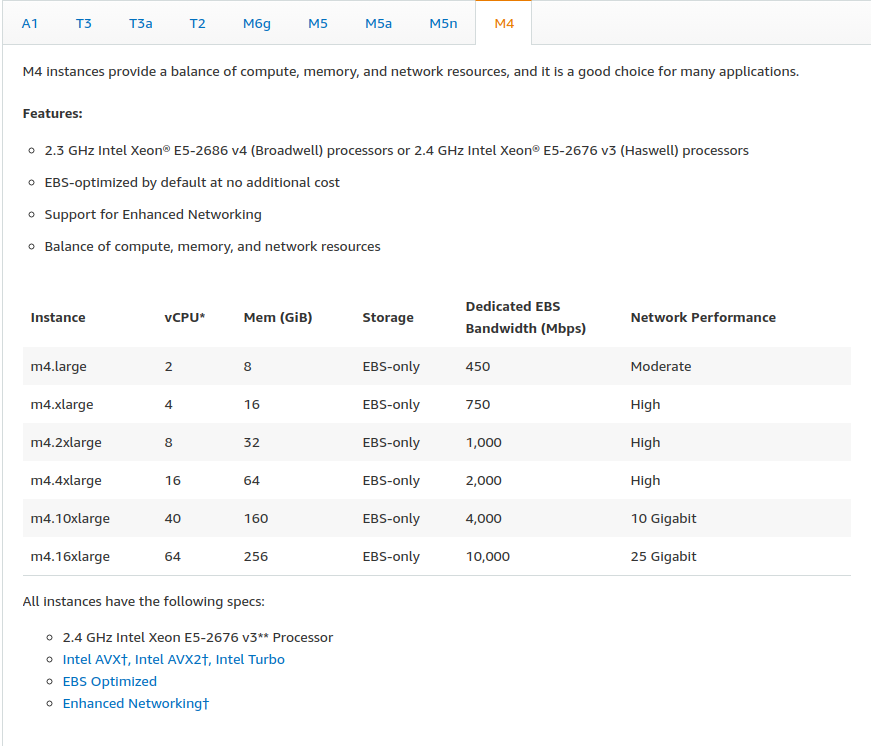
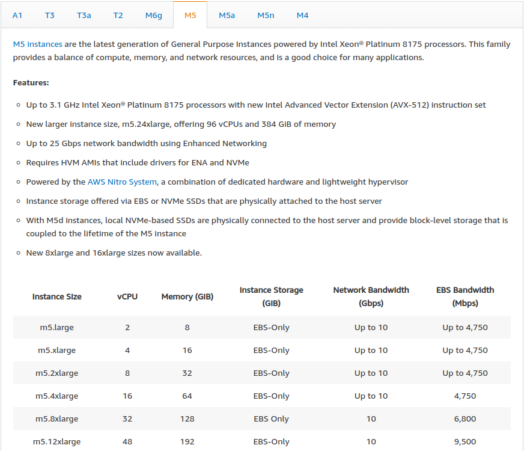
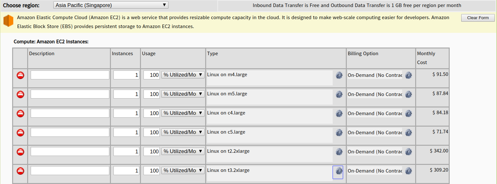

# Cost Optimization on AWS Cloud - Part 1

ဒီနေ့မှာတော့ကျွန်တော်တို့ Amazon Web Services အသုံးပြုနေကြတဲ့သူတွေအတွက် အသုံးဝင်လောက်မဲ့ articleလေး တစ်ခုကိုရေးပေးချင်ပါတယ်။ ကျွန်တော်တို့ ရုံးတွေ Organizationတွေ မှာ AWS သုံးကြတယ် Costတွေ ကလည်း တော်တော်လေးကုန် ကျနေတယ် ဘာတွေကကုန်နေမှန်းလည်း မသိဘူး Billing Console မှာတော့ပြနေတယ် ဘာတွေအတွက်ကဘယ်လောက် ဘယ်လောက်ကုန်နေတယ် ဒါပေမယ့် သူတို့ဘယ်လိုဘယ်လိုတွက်လိုက်လဲ မသိဘူးဖြစ်နေတယ်ဆိုရင် ၊ Cost တွေ ကအဆမတန်ကုန်ကျနေတယ်ဆိုရင်  အခု article လေး က သင့်အတွက် လက်ရှိကုန်ကျနေတဲ့ Cost တွေရဲ့ တွက်ချက်ပုံ အကြမ်းဖျင်းနဲ့ Optimization သဘောတရား များကို အနည်းနဲ့အများ နားလည် သဘောပေါက်ပြီး အထောက်အကူပြုလိမ့်မယ်လို့ ယုံကြည်ပါတယ်။ ဟုတ်ပြီ အဲ့တော့ စလိုက်ကြရအောင်။

### Foundation of Cost Optimization

ကျွန်တော်တို့ အနေနဲ့ ဘယ်လိုစလုပ်မလဲ

* အရင်ဆုံးကိုယ်က AWS ရဲ့ ဘယ် service တွေကို သုံးထားလဲသိရပါမယ်   
  ဥပမာ - ဘယ် Region မှာ ဘာ service ကိုသုံးထားလဲပေါ့ ၊ North Virginia \( us-east-1 \)

   မှာ EC2 သုံးထားတာလား Europe \( Paris - eu-west-3 \)မှာ RDS သုံးထားတာလား စသဖြင့်ပေါ့   

* ပြီးတော့ ကိုယ်သုံးထားတဲ့ service တွေရဲ့ pricing ကိုသေချာသိရပါမယ် ၊ ဒီမှာဘာပြသနာရှိလဲဆိုတော့ AWS က သူရဲ့ Region အလိုက် Service Pricing တွေက အများကြီးရှိတဲ့ အတွက်အကုန်တော့ ထည့်မပြောနိုင်တော့ပါဘူး။  ဥပမာအနေနဲ့ မြင်သာအောင်ပြောရမယ်ဆိုရင် North Virginia \( us-east-1 \) မှာ ရှိတဲ့ EC2 Pricing နဲ့ Singapore \( ap-southeast-1 \) မှာရှိတဲ့ EC2 Pricing က မတူပါဘူး။ 

ဒီပုံမှာကြည့်မယ်ဆိုရင် US East \( N. Virginia\) EC2 t3.medium price per hour က **$​0.0416** ပဲကျသင့်မှာဖြစ်ပြီးတော့ Asia Pacific \( Singapore \) EC2 t3.medium price per hour က **$0.0528** ကျသင့်မှာပါ။  တစ်ခြားသော Instance Type တွေလည်း ထိုနည်းလည်းကောင်းပါပဲ။ US East \( N. Virginia \) ကပိုသက်သာပါတယ်။ ဆိုလိုတာကတော့ ကျွန်တော်တို့တွေအနေနဲ့ ကိုယ်ရဲ့ company requirement  အရ Region အလိုက်စျေးနှုန်းတွေကို အကြမ်းဖျင်နားလည်ထားရပါမယ်။ ဒါဆိုဘာလို့ US East \( N. Virginia \) ကပိုသက်သာတာလဲဆိုရင် AWS ရဲ့ Default Region ဖြစ်တာလည်း တစ်ကြောင်း၊ များပြားတဲ့ Customer တွေကို Service ပေးနိုင်ဖို့ Resource များများရှိတာရယ်၊ Physical Datacenter တွေအတွက် လိုအပ်တဲ့ Electrical Power ရပုံခြင်းမတူတာရယ် နိုင်ငံရဲ့ Tax rule ဘာညာအနေအထားတွေ မတူညီတာရယ်ကြောင့်လို့ ယေဘုယျ ဆိုနိုင်ပါတယ်။ Pricing တွေ ကို သဘောတရားကိုမြန်မြန်နားလည်နိုင်မဲ့ အမြန်ဆုံးနည်းလမ်းကတော့ ကိုယ့် Manage လုပ်ရတဲ့ AWS account ရဲ့ Billing Console ကို မနက်တိုင်းကြည့်ပြီး တစ်လလောက် Calculator တစ်လုံးဘေးချပြီးလိုက်တွက်ကြည့်ပါ။ \( စာရေးသူ၏ ကိုယ်တွေမှတ်တမ်းက ကောက်နှုတ်ချက် \) 

* အိုကေ ကိုယ်ကဘယ် Service တွေ ကိုသုံးထားတာလဲနဲ့ Pricing ကိုလည်း နားလည်နေပြီဆိုရင် နောက်တစ်ခု သိရမှာက ကိုယ်သုံးထားတဲ့ Service Resources တွေရဲ့ Workload ပါ။  ဆိုလိုတာက EC2 Workload တွေ CPU Utilization တွေ Memory Utilization တွေ Network Traffic တွေ ဘယ်အချိန်မှာဘယ်လောက်တော့ သုံးတယ် ဘယ်အချိန်မှာတော့ ဘယ်လောက်ပဲသုံးတော့တယ်ဆိုတာကို သိရပါမယ်။ အဲ့အတွက်လည်း ကိုယ်ရဲ့ Infrastructure သိုမဟုတ် ကိုယ့်ရဲ့ Resource ကို monitoring တွေ လုပ်ထားဖို့လိုပါတယ်။ Monitoring and Metric တွေ Logs တွေ ကြည့်ဖို့အတွက်လည်း AWS [**CloudWatch**](https://aws.amazon.com/cloudwatch/) ရှိပါတယ်။ကျွန်တော်တို့အနေနဲ့  Metric တွေကိုလည်း အမြဲမပြတ်ကြည့်နေဖို့ လိုပါတယ်။ ဘာလို့လဲဆိုတော့  Metric တွေက ရတဲ့ Data အချက်အလက်တွေက သင့်ကို Cost Optimization ပြု လုပ်ရာမှာ တစ်ထောင့်တစ်နေရာကနေ အထောက်အကူပြုမှာပါ။ ဒီအကြောင်းကိုနောက်မှဆက်ပြောပါမယ်။ 

* နောက်တစ်ဆင့်အနေနဲ့ ကျွန်တော်တို့ အနေနဲ့ Cost Optimization ပြု လုပ်မယ်ဆိုရင် ကိုယ်သုံးနေတဲ့ ဘယ် Service တွေကို လုပ်မယ်ဆိုတာ အရင် List လုပ်ရပါမယ်။ Cost တော့ လျော့ချချင်တယ် ဘယ်ဟာကိုလျော့လို့ လျော့ရမယ်မှန်းမသိလို့ မရပါဘူး။ ဘယ် Service တွေက သိပ်မသုံးဘူးလဲ EC2 Instance တွေကို မလိုပဲဖွင့်ထားမိလား ကိုယ်မသုံးပဲနဲ့ အပိုတွေ ဖြစ်နေတဲ့ Resource တွေရှိလား အရင်ကြည့်သင့်ပါတယ်။ အသုံးမလိုပဲဖွင့်ထားမိတဲ့ resource တွေက လွယ်လွယ်နဲ့ Cost Optimize လုပ်လို့ရတဲ့ အခြေခံအချက်ပဲဖြစ်ပါတယ်။ သဘောတရားကတော့ ရှင်းပါတယ်။ မသုံးပဲပိုနေတဲ့ Resource တွေကို ဖျက်ပစ်လိုက်ပါ။ 


အသုံးမပြုပဲ ပိုနေတဲ့ resource တွေကို ဖျက်တဲ့အခါမှာ မိမိ team member တွေနဲ့ သေချာ confirm လုပ်ပြီးမှဖျက်သင့်ပါတယ်။ 


* နောက်တစ်ခုကတော့ AWS က သူရဲ့ Ecosystem ထဲမှာ အသုံးပြုဖို့ ထုတ်ပေးထားတဲ့ Tools တွေကို အသုံးပြုပြီး ဘယ် Resource တွေက Utilization တွေနည်းလည်းဆိုတာတွေကို ကြည့်ပြီး Cost Optimize လုပ်ရပါမယ်။ 


Under Utilized  ဖြစ်နေတဲ့ Resource တွေကို ကြည့်ဖို့ [**AWS Trusted Advisor**](https://aws.amazon.com/premiumsupport/trustedadvisor/) နဲ့ Cost တွေရဲ့ Data Metric တွေကြည့်ဖို့ [**AWS Cost Explorer**](https://aws.amazon.com/aws-cost-management/aws-cost-explorer/) ရှိပါတယ်။


အကောင်းဆုံးက တော့ Tools တွေ အကူအညီ နဲ့ Monitoring က ရတဲ့ Metric Data တွေကို ကြည့်ပြီး ကိုယ်နဲ့ အကိုက်ညီဆုံးဖြစ်အောင် ကိုယ့် Organization နဲ့ Fit in ဖြစ်မဲ့ Cost Optimization ကိုပြုလုပ်လို့ရပါပြီ။ 

### Right Sizing

Right Sizing ဆိုတာက တော့ ကိုယ်တော့ တို့ အနေနဲ့ ကိုယ့် ရဲ့ Infrastructure နဲ့ Application workloads တွေကို သေချာသိပြီဆိုရင်တော့  ဘယ် Instance တွေကတော့ Under Utilized ဖြစ်နေလဲ Over Provision ဖြစ်နေလဲဆိုတာကို ခွဲခြမ်းစိတ်ဖြာပြီး ရှိသင့် ရှိထိုက် ဖြစ်သင့် ဖြစ်ထိုက် သုံးသင့် သုံးထိုက် တဲ့ Resource တွေကို သေချာရွေးချယ်လို့ပြောရပါမယ်။ ဆိုလိုတာက ဥပမာ Monitoring Metric တွေအရ CPU 2vCore RAM 4GB ပဲလိုတဲ့ Peak Hour တွေမှ အများဆုံးအဲသည်လောက်ပဲသုံးတဲ့ Application တင် run  Instance  Sizeကို ကျွန်တော်တို့က CPU 4vCore RAM 8GB ပေးထားမိတယ်ဆိုရင် ကျွန်တော်တို့က Over Provision ဖြစ်နေတယ်ဆိုတာသေချာပါပြီ။ အဲ့သည် Instance အတွက် Right Sizing ကိုမဖြစ်မနေလုပ်သင့်ပါပြီ။  Right Sizing ကျွန်တော်တို့က  ပြုလုပ်ရာမှာလည်း Cost and Performance Trade-offs လေး တွေကိုလည်း သတိထားသင့်ပါတယ်။ Optimization လုပ်လိုက်လို့ Cost နည်းသွားပြီး Performance ကျသွားလို့ မရပါဘူး။ မရပါဘူးဆိုတာထပ် အဆင်မပြေတာပါ။ Performance ကျရင် Business Impact တွေ ရှိလာနိုင်ပါတယ်။ Infrastructure Price and Performance Trade-offs အတွက်လည်း AWS မှာဆိုရင် ကျွန်တော်တို့အနေနဲ့ Next Generation Resource တွေကို ရွေးချယ်အသုံးပြုခြင်းဖြင့် Cost လည်းအကုန်အကျသက်သာ Performance လည်းမထိခိုက် \( တစ်ချို့ Resource တွေဆိုရင် Cost သက်သာပြီး Performance သိသိသာသာတိုးလာတာမျိုး \)  စေတဲ့ အတွက် တော်တော်လေးကိုအဆင်ပြေပါတယ်။ 

Lastest Generation Resource ဆိုတာကတော့ AWS ရဲ့ EC2, RDS, ElastiCache, ElasticSearch မှာသုံးထားတဲ့ Underlying Hardware Resource တွေရဲ့ Generation ကိုဆိုလိုတာပါ။ ကျွန်တော်တို့ အနေနဲ့ Last Generation Resource တွေကနေ Price to performance ကို advantage ယူလို့ရပါတယ်။  

အပေါ်က ပုံ ၂ ပုံမှာတော့ Previous Generation General Instance \( M4 \) နဲ့ Lastest Generation General Instance \( M5 \) Performance ကွာခြားပုံလေးကိုပြထားတာဖြစ်ပါတယ်။ Latest Generation မှာ ဘာတွေ Advantage ရလဲဆိုရင် သိသိသာသာဖြစ်တာက Underlying CPU Generation , Network Bandwidth \( Gbps \) နဲ့ EBS Bandwidth \( Mbps \) တို့ပဲဖြစ်ပါတယ်။ ဒါကတော့ Performance Advantage ပါ။ 

နောက်တစ်ခုက Latest Generation Instance တွေရဲ့ Cost Advantage ပါ။ 

M4 vs M5 , C4 vs C5 , T2 vs T3 ကိုကြည့်မယ်ဆိုရင် Latest Generation ကိုသုံးခြင်းဖြင့် Cost and Performance Advantage ရမှာပါ။ အချုပ်ကိုပြောရမယ်ဆိုရင်တော့ Right Sizing လုပ်တဲ့ အခါ ဒီလိုအချက်တွေထည့်သွင်းစဉ်းစားဖို့လိုပြီး Cost and Performance 

###  

\*\*\*\*

