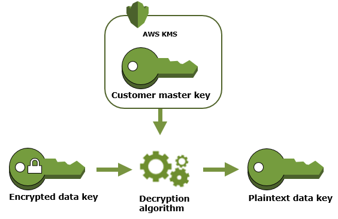

# S3 Encryption အကြောင်း တစေ့တစောင်း

AWS မှာ Data တွေကို သိမ်းဖို့အတွက် durable ဖြစ်တဲ့ S3\(Simple Storage Service\) ကိုသုံးဖို့ ဆုံးဖြတ်လိုက်တာနဲ့  “data လုံခြုံမှု” ဆိုတဲ့  အချက်ဟာ နောက်ဆက်တွဲထည့်သွင်းစဉ်းစားသင့်တဲ့ အချက်တစ်ခု အနေနဲ့ရှိနေပါတယ်။  Data တွေလုံခြုံမှုရှိဖို့အတွက် AWS က S3 အတွက်    ပံ့ပေးတဲ့ data protection နည်း \(၂\) မျိုးကို အသုံးပြုလို့ရပါတယ်။ ထိုနည်း \(၂\) မျိုး ကတော့-

\(၁\) Data တွေ Instance /Server မှ S3 သို့  ဖြစ်စေ၊ S3 မှ Instance သို့ဖြစ်စေ ကူးပြောင်းနေဆဲအချိန်မှာ Secure Socket Layer/ Transport Layer Security \(SSL/TLS\) ကိုအသုံးပြုပြီး encrypt တဲ့ **In Transit** နဲ့

\(၂\) **At rest**  တို့ပဲဖြစ်ပါတယ်။ **At Rest** မှာမှ

\(၁\) Server-Side Encryption

* Amazon S3-Managed Keys\(SSE-S3\) \(default\)
* AWS KMS-Managed Keys \(SSE-KMS\)
* Customer-Provided Keys \(SSE-C\) နဲ့

\(၂\) Client-Side Encryption

* AWS KMS-managed customer master key
* client-side master key ဆိုပြီးရှိပါတယ်။

### **Client-Side Encryption**

Data sensitivity ပေါ်မူတည်ပြီး S3 ပေါ် မတင်မီ encrypt လုပ်၊မလုပ်ဆိုတာ ကို user ဘက်ကဆုံးဖြတ်ပိုင်ခွင့်ရှိပါတယ်။ S3 မတင်မီ encryption လုပ်ရတဲ့ client side encryptionကို ရွေး မယ်ဆိုရင်တော့ key creation, key management,key storing နှင့်အတူ ဘယ် software ကိုသုံးပြီး encrypt မလဲဆိုတာ ကိုပါ user ကရွေးချယ်ရမှာ ဖြစ်ပါတယ်။ ဒီနည်းလမ်းကို အသုံးပြုခြင်းအားဖြင့် highly sensitive ဖြစ်တဲ့ data များကို AWS ရဲ့ Plaintext နဲ့ ရောယှက်စရာ မလိုဘဲ encrypt လုပ်လို့ရတဲ့အပြင် user ကသာ key ကိုင်ဆောင်ခွင့် ရမှာ ဖြစ်ပါတယ်။ user ဘက်က S3 ဆီ data မပို့မီ data ကို encrypt ပြီး S3 ကနေ data retrieval လုပ်ပြီးမှပဲ decryption လုပ်မှာဖြစ်ပါတယ်။

Client side encryption နည်းကိုသုံးဖို့ ဖြစ်လာရင်တော့ AWS Encryption SDK ကို အသုံးပြုပြီး encryption နှင့် decryption ကို လွယ်ကူရှင်းလင်းအောင် လုပ်ဆောင်နိုင်မှာဖြစ်ပါတယ်။ AWS Encryption SDK ဟာ Programming language များစွာ ကိုအသုံးပြုပြီး သုံးနိုင်တဲ့အပြင် KMS-managed keys နဲ့ customer-provided keys တွေ အတွက် SDK CLI \(Command Line Interface\) ကိုလည်းအသုံးပြုနိုင် အောင် လုပ်ဆောင်ပေးမှာဖြစ်ပါတယ်။

### **Server-Side Encryption**

ပိုပြီးရိုးရှင်းတဲ့ Server Side Encryption\( SSE \) က Client Side Encryption နဲ့တူတဲ့ အရာတွေရှိပေမယ့် ပိုပြီး အမျိုးအစားစုံလင်စွာ Encrypt \(ဥပမာ- Customer Provided key\) လို့ရပါတယ်။ ဒါကြောင့်မလို့ ကိုယ်နဲ့သင့်တော်မယ့် Encryption နည်းကို စိတ်တိုင်းကျရွေးနိုင်တာကြောင့် ရိုးရိုးရှင်းရှင်း key \(သို့\) ရှုပ်ထွေးတဲ့ key သုံး မလား ဆိုတဲ့ အချက်ကိုပါ user ဘက်က ဆုံးဖြတ်နိုင်တဲ့ အတွက် ပိုပြီးတော့ ရွေးချယ်ဖို့ သင့်တော်ပါတယ်။ Encrypt မလုပ်ရသေးတဲ့ raw data တွေကို AWS ဆီပို့တဲ့ ပြီးတဲ့အခါ AWS ဘက်မှာ encrypt လုပ်ပြီး cloud storage \(S3\) ပေါ်သိမ်းလိုက်ပါတယ်။ Encrypted data တွေကိုပြန်ပြီး retrieve မယ်ဆိုရင်တော့ amazon က encrypted data ကို ဖတ်ပြီး server ဘက္် မှာပဲ decrypt လုပ်ပါတယ်။ ပြီးရင်တော့ decrypted date \( unencrypted data \) ကို userဆီ အင်တာနက် \(HTTP\) ကတစ်ဆင့် ပို့လိုက်ပါတယ်။

* SSE- S3 – အရိုးရှင်းဆုံး နည်းဖြစ်ပြီး data ကို encrypt လုပ်ဖို့ key ကိုတော့ aws က ကိုင်ဆောင်ထားပါတယ်။ ဒီအချက်က ဘာကို ဆိုလိုတာလဲ ဆိုရင်တော့ user ဘက်က key ကို မမြင်နိုင်တဲ့အပြင် manually လည်းသုံးခွင့်ရှိမှာမဟုတ်ပါဘူး။ Default algorithm ကတော့ AES-256 ဖြစ်ပါတယ်။ 
* SSE-KMS – ဒီမှာတော့ server ဘက်မှာ S3 data encryption လုပ်ဖို့ AWS Key Management Service \(KMS\) ကို သုံးပါတယ်။ data keyကိုတော့ AWS က ထိန်းသိမ်းပြီးတော့ AWS KMS ထဲက customer master key \(CMK\) ကိုတော့ user ကထိန်းသိမ်းခွင့်ရှိပါတယ်။ SSE-KMS သုံးခြင်းရဲ့ အကျိုးတွေကတော့ user control ရနိုင်ခြင်းနဲ့  audit ပိုင်းပါဝင်နိုင်ခြင်းဖြစ်ပါတယ်။ 
* SSE-C – key ကို customer က ကိုယ်တိုင်ထုတ်ပြီးတော့ AWS က အဲ့ encryption key ကို သိမ်းထားမှာမဟုတ်ပါဘူး။ ထုတ်ပေးလိုက်တဲ့ key ကို AWS ဆီ ပေးလိုက်ပြီး data encryption, decryption နဲ့ ဆိုင်ရာ request တိုင်းကို handle လုပ်စေမှာဖြစ်ပါတယ်။ User ဘက်က key ရဲ့ လုံခြုံရေးအတွက် အပြည့်အဝတာဝန်ယူရမှာဖြစ်ပါတယ်။ KMS နဲ့မတူတဲ့အချက်ကတော့ master key ရော data key ရော user က ကိုင်ဆောင်ထိန်းသိမ်းခွင့်ရမှာဖြစ်ပါတယ်။

ကျေးဇူးတင်ပါတယ်။   
[**AWS User Group Myanmar**](https://www.facebook.com/awsugmm/)  
**ခင်ချမ်းမြေ့ထွန်း**

