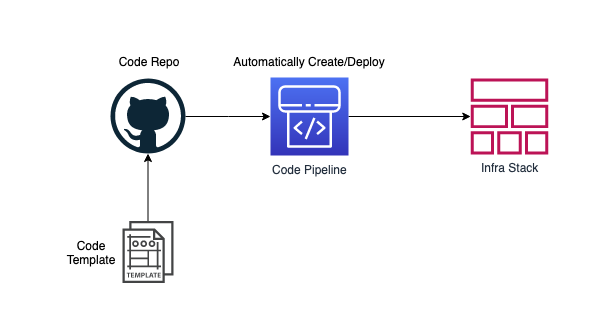
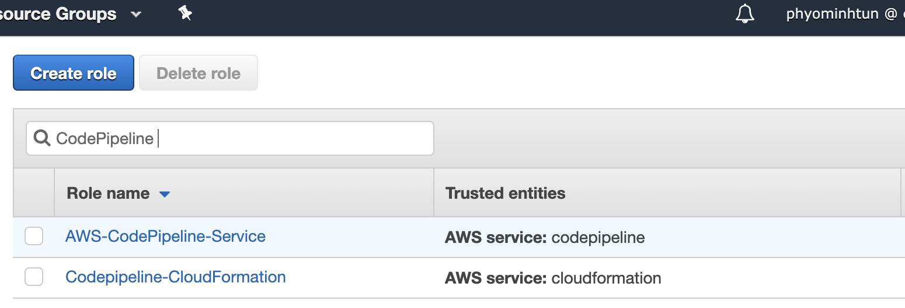
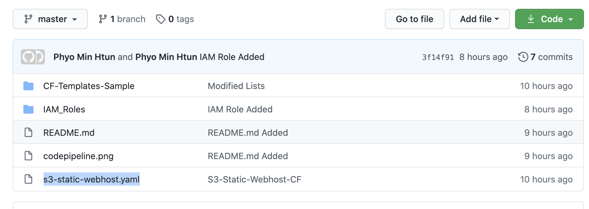
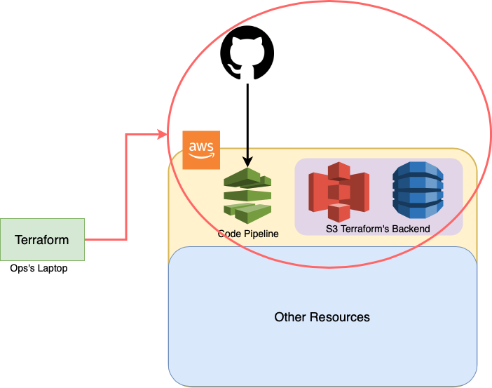
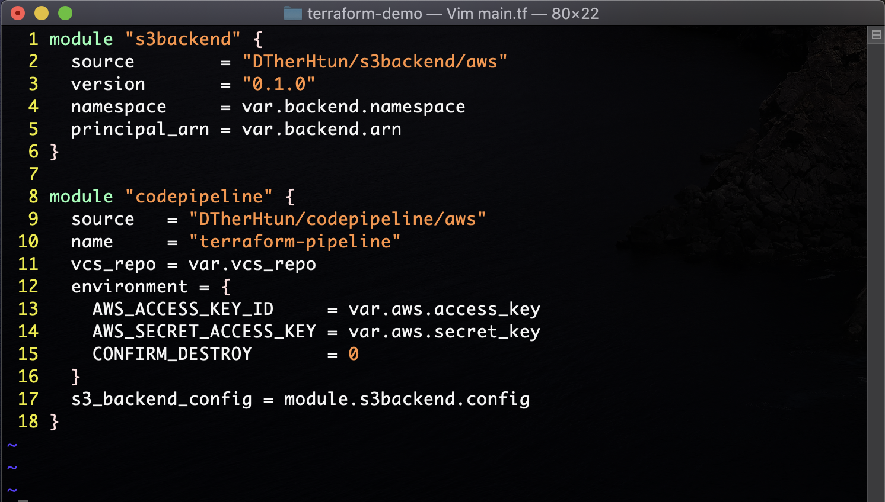
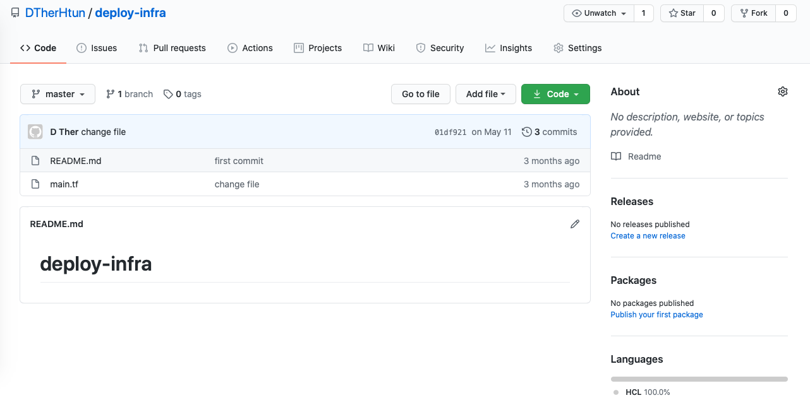
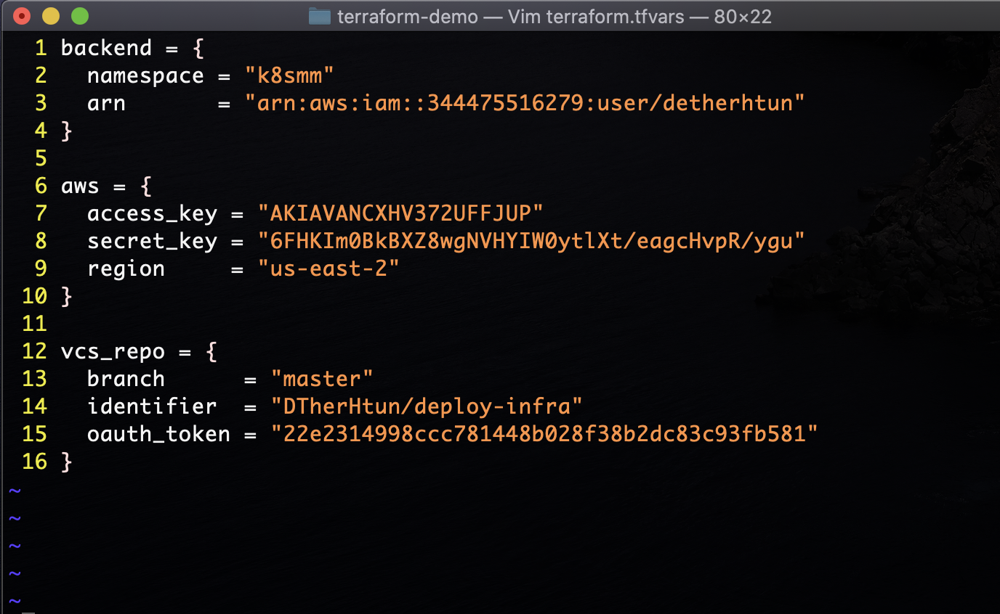
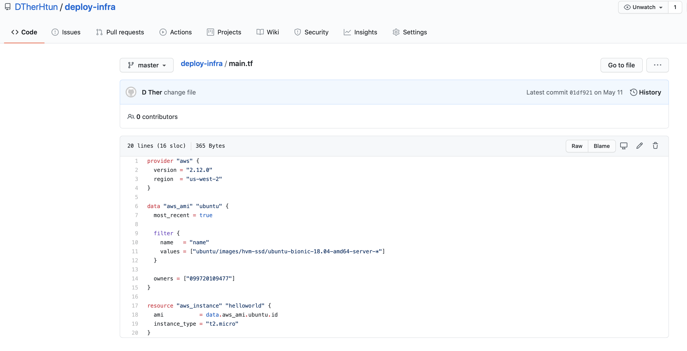
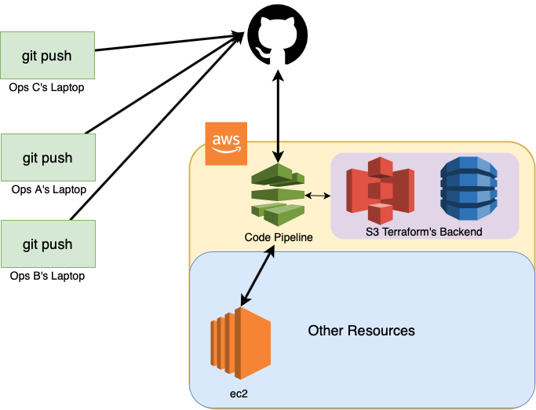

# Infrastructure as Code with AWS CodePipeline


AWS User Group Myanmar Blog မှာ tutorial တစ်ခုရေးမယ်ဆိုပြီး အလုပ်မအားတာက တကြောင်း .. Project တွေပိနေတာနဲ့ မရေးဖြစ်တာတောင်တော်တော်ကြာသွားပြီ နဂို စာရေးပျင်းတာလည်းပါတာပေါ့။ အခု Project တစ်ခုလုပ်နေရင်း Idea လေးတစ်ခုရတာနဲ့ Infrastructure as Code ကို AWS မှာ Continuous Delivery Pipeline နဲ့လုပ်တာလေးရေးမယ်ဆိုပြီး ဒီ tutorial လေးကိုရေးဖြစ်တာ။ ဆိုတော့ဒီ tutorial လေးကို အစက AWS User Group Myanmar Meetup တွေ Workshop event တွေမှာပြောမယ်ပေါ့.. Covid19 ဖြစ်သွားတော့ပွဲလည်းအပြင်မှာ မလုပ်ဖြစ်တော့ Online ပွဲမှာ Workshop လုပ်ရတာအားလည်းမရတာနဲ့ စာပဲရေးမယ်ဆိုပြီးဆုံးဖြတ်ဖြစ်သွားတယ်။ ဒီ tutorial မှာ နှစ်ပိုင်းပါမယ် ။ တစ်ပိုင်းက ကျနော် IaC Pipeline ကို AWS CloudFormation and AWS CodePipeline နဲ.အသုံးပြုတာကိုရေးသွားမယ် နောက်တစ်ပိုင်းက ညီလေး ဒီသာထွန်း က သူက Terraform နဲ့ ရေးထားတာရှိတယ်ဆိုတာနဲ့ နှစ်ယောက်ပေါင်းပြီးရေးဖြစ်သွားတယ်ပေါ့။ Terraform ကို AWS CodePipeline နဲ့ AWS CloudFormation ကို AWS CodePipeline နဲ့ဆိုပြီးတော့နှစ်ပိုင်းပေါ့။ 

အိုခေ ဒါဆိုနိဒါန်း ချွေနေတာကလည်း တော်တော်များပြီဆိုတော့ ပထမဆုံးအနေနဲ့  **Infrastructure as Code \( IaC \) ဆိုတာဘာလဲ?** ဘာအတွက်သုံးတာလဲ? ဆိုပြီးမေးခွန်းတွေရှိတယ်။ ဆိုတော့ကာ နောက်ပိုင်း DevOps တို. Automation တွေ အလုပ်များလာတာနဲ့အမျှ Infrastructure as Code ကိုနောက်ပိုင်း Organization Infrastructure တွေမှာ အသုံးပြုလာကြပါတယ်။ အရှင်းဆုံးပြောရရင်တော့ Infrastructure as Code ဆိုတာ လက်ရှိကျနော်တို.တွေ manual တည်ဆောက်ကြတဲ့ Infrastructure တွေ Server, Database အစရှိတဲ့ resource တွေကို code နဲ့ automated တည်ဆောက်တာကို ဆိုလိုပါတယ် Cloud Infrastructure မှာဖြစ်ဖြစ် On-Premesis Infrastructure မှာပဲ ဖြစ်ဖြစ်ပေါ့။   
Code နဲ့တည်ဆောက်တယ်ဆိုတာ Programming Code တစ်ခုခု နဲ့ဖြစ်ဖြစ် Configuration Code တွေနဲ့ဖြစ်ဖြစ် တည်ဆောက်နိုင်ပါတယ်။ အထူးသဖြင့် infrastructure orchestration tools တွေဖြစ်တဲ့ Terraform တို. AWS မှာ ဆို AWS CloudFormation တို.ကို အသုံးပြုလေ့ရှိပါတယ်။တခြား Provider တွေက tools တွေလည်းရှိပါတယ်။သေချာလေ့လာပြီး သိချင်ရင်အောက်က လင့်မှာဖတ်နိုင်ပါတယ်။   



[https://blog.newrelic.com/engineering/best-cloud-infrastructure-automation-tools/](https://blog.newrelic.com/engineering/best-cloud-infrastructure-automation-tools/)


အဲ့တော့ Infrastructure ကို Code တွေနဲ့ရေးပြီးတည်ဆောက်မယ် ပြီးတော့ Code Repository ဖြစ်တဲ့ Github မှာတင်လိုက်တာနဲ့ Auto Deploy သွားနိုင်အောင် CI/CD Pipeline တွက် AWS Code Pipeline ကိုအသုံးပြုပြီး Deploy သွားမယ်။ 


[https://aws.amazon.com/codepipeline/](https://aws.amazon.com/codepipeline/)




ကျွန်တော်တိုအပေါ်က Diagram လို Infrastructure as Code တွက် AWS CloudFormation Template ရေးမယ် ပြီးရင် GitHub Repository မှာ Push မယ် Push လိုက်တာနဲ့ တပြိုင်နက် AWS CodePipeline က Trigger မိပြီး Automatically Infrastructure Stacks တွေကို သွားဆောက်မယ် အဲ့လိုဆိုတော့ ကျနော်တို.အရင် ဆုံး AWS CloudFormation Template ရေးဖို.တွက်ကို ကျနော် စလုပ်ပါမယ်။ဒီ tutorial မှာ စမ်းမှာက Amazon S3 Static WebHost Bucket ကို CloudFormation နဲ. auto တည်ဆောက်တဲ့ Template ကို သုံးမှာဖြစ်ပြီး ကိုယ်ကိုတိုင်အသုံးပြုရင်တော့ ကိုယ်ကြိုက်တဲ့ resource ကို CloudFormation နဲ့တည်ဆောက်လို.ရပါတယ် ဥပမာ EC2 တို. RDS တို. VPC  တို.ဆောက်တာပေါ ့။ 

အိုခေ ဒါဆို ပထမဆုံး အနေနဲ့ ကျနော်တို. CloudFormation မလုပ်ခင်အရင်ဆုံး ကျွန်တော်တို. AWS IAM Role တွေတည်ဆောက်ရပါမယ်။ Role ကတော့ **နှစ်ခု** ဆောက်ပေးရပါ။ 

1. CodePipeline IAM Role 
2. CloudFormation IAM Role ဆိုပြီးတော့ Role နှစ်ခုအရင်ဆောက်ရပါမယ်။ ဒီ လင့်ကနေ policy ကို download လုပ်ပြီးတည်ဆောက်နိုင်ပါတယ်။ 


[https://github.com/phyominhtun1990/cloudformation-codepipeline](https://github.com/phyominhtun1990/cloudformation-codepipeline)


```text
{
    "Statement": [
        {
            "Action": [
                "s3:GetObject",
                "s3:GetObjectVersion",
                "s3:GetBucketVersioning"
            ],
            "Resource": "*",
            "Effect": "Allow"
        },
        {
            "Action": [
                "s3:PutObject"
            ],
            "Resource": [
                "arn:aws:s3:::codepipeline*",
                "arn:aws:s3:::elasticbeanstalk*"
            ],
            "Effect": "Allow"
        },
        {
            "Action": [
                "codecommit:CancelUploadArchive",
                "codecommit:GetBranch",
                "codecommit:GetCommit",
                "codecommit:GetUploadArchiveStatus",
                "codecommit:UploadArchive"
            ],
            "Resource": "*",
            "Effect": "Allow"
        },
        {
            "Action": [
                "codedeploy:CreateDeployment",
                "codedeploy:GetApplicationRevision",
                "codedeploy:GetDeployment",
                "codedeploy:GetDeploymentConfig",
                "codedeploy:RegisterApplicationRevision"
            ],
            "Resource": "*",
            "Effect": "Allow"
        },
        {
            "Action": [
                "elasticbeanstalk:*",
                "ec2:*",
                "elasticloadbalancing:*",
                "autoscaling:*",
                "cloudwatch:*",
                "s3:*",
                "sns:*",
                "cloudformation:*",
                "rds:*",
                "sqs:*",
                "ecs:*",
                "iam:PassRole"
            ],
            "Resource": "*",
            "Effect": "Allow"
        },
        {
            "Action": [
                "lambda:InvokeFunction",
                "lambda:ListFunctions"
            ],
            "Resource": "*",
            "Effect": "Allow"
        },
        {
            "Action": [
                "opsworks:CreateDeployment",
                "opsworks:DescribeApps",
                "opsworks:DescribeCommands",
                "opsworks:DescribeDeployments",
                "opsworks:DescribeInstances",
                "opsworks:DescribeStacks",
                "opsworks:UpdateApp",
                "opsworks:UpdateStack"
            ],
            "Resource": "*",
            "Effect": "Allow"
        },
        {
            "Action": [
                "cloudformation:CreateStack",
                "cloudformation:DeleteStack",
                "cloudformation:DescribeStacks",
                "cloudformation:UpdateStack",
                "cloudformation:CreateChangeSet",
                "cloudformation:DeleteChangeSet",
                "cloudformation:DescribeChangeSet",
                "cloudformation:ExecuteChangeSet",
                "cloudformation:SetStackPolicy",
                "cloudformation:ValidateTemplate",
                "iam:PassRole"
            ],
            "Resource": "*",
            "Effect": "Allow"
        },
        {
            "Action": [
                "codebuild:BatchGetBuilds",
                "codebuild:StartBuild"
            ],
            "Resource": "*",
            "Effect": "Allow"
        },
        {
            "Effect": "Allow",
            "Action": [
                "devicefarm:ListProjects",
                "devicefarm:ListDevicePools",
                "devicefarm:GetRun",
                "devicefarm:GetUpload",
                "devicefarm:CreateUpload",
                "devicefarm:ScheduleRun"
            ],
            "Resource": "*"
        },
        {
            "Effect": "Allow",
            "Action": [
                "servicecatalog:ListProvisioningArtifacts",
                "servicecatalog:CreateProvisioningArtifact",
                "servicecatalog:DescribeProvisioningArtifact",
                "servicecatalog:DeleteProvisioningArtifact",
                "servicecatalog:UpdateProduct"
            ],
            "Resource": "*"
        },
        {
            "Effect": "Allow",
            "Action": [
                "cloudformation:ValidateTemplate"
            ],
            "Resource": "*"
        }
    ],
    "Version": "2012-10-17"
}
```

```text
{
  "Version": "2012-10-17",
  "Statement": [
    {
      "Sid": "",
      "Effect": "Allow",
      "Principal": {
        "Service": "codepipeline.amazonaws.com"
      },
      "Action": "sts:AssumeRole"
    }
  ]
}
```



ပြီးရင်အပေါ်ကပုံအတိုင်းကျနော်တို. IAM Role နှစ်ခုရလာပါလိမ့်မယ်။ပြီးသွားရင်ကျနော်တို.တွေ S3 Static WebHost Bucket တည်ဆောက်တဲ့ AWS CloudFormation Template ကို Github ပေါ်ကိုတင်ပါမယ်။ကျနော်ကတော့တင်ထားပြီးသားဆိုတော့  GitHub ပေါ်မှာရောက်နေပါလိမ့်မယ်။  



```text
## CloudFormation Template Sample - AWS S3 StaticWebHost Bucket

AWSTemplateFormatVersion: 2010-09-09
Resources:
  S3Bucket:
    Type: AWS::S3::Bucket
    Properties:
      AccessControl: PublicRead
      WebsiteConfiguration:
        IndexDocument: index.html
        ErrorDocument: error.html
  BucketPolicy:
    Type: AWS::S3::BucketPolicy
    Properties:
      PolicyDocument:
        Id: Mys3bucketPolicy
        Version: 2012-10-17
        Statement:
          - Sid: PublicReadForGetBucketObjects
            Effect: Allow
            Principal: '*'
            Action: 's3:GetObject'
            Resource: !Join 
              - ''
              - - 'arn:aws:s3:::'
                - !Ref S3Bucket
                - /*
      Bucket: !Ref S3Bucket
Outputs:
  WebsiteURL:
    Value: !GetAtt 
      - S3Bucket
      - WebsiteURL
    Description: URL for website hosted on S3
  S3BucketSecureURL:
    Value: !Join 
      - ''
      - - 'https://'
        - !GetAtt 
          - S3Bucket
          - DomainName
    Description: Name of S3 bucket to hold website content
```

ဒီလိုရောက်နေပြီဆိုရင် ကျွန်တော်တို. AWS Management Console ကနေ AWS CodePipeline ကိုတည်ဆောက်ပါမယ်။ ပြီးရင်ကျနော်တို. AWS CodePipeline နဲ့ Github နဲ့ကို ချိတ်ပါမယ်။   
အရင်ဆုံး AWS Console ကနေ CodePipeline Service ကိုသွားမယ်။ ပြီးရင် Create Pipeline ဆိုပြီး  Pipeline အသစ်တစ်ခုဆောက်မယ်။ 

အဲ့ဒီမှာ Role နေရာမှာ Existing service role ကိုရွေးချယ်ပြီး အပေါ်မှာတည်ဆောက်ထားတဲ့ IAM Role နှစ်ခုထဲက CodePipeline IAM Service Role ကို ရွေးထည့်ပေးရပါမယ်။ 


ပြီးသွားရင် Add Source Stage မှာ GitHub Repo နဲ့ချိတ်ပေးရပါမယ်။ချိတ်ဆက်ပြီးသွားရင်တော့ ကိုယ့် Github Repo တွေကိုတွေ.ရပါမယ်။ အဲ့ကနေမှာ ခုနက ကိုယ် CloudFormation Template store ထားတဲ့ Repo ကို ရွေးချယ်ပြီး  Webhooks တည်ဆောက်ပေးရပါမယ်။ 


ပြီးရင် Build Stage ကို ကျော်မယ်။ ထို.နောက် Deployment Provider ကို AWS CloudFormation ရွေးပေးပြီး Artifact name မှာ SourceArtifact နှင့် File name မှာ AWS CloudFormation Template name ကို ထည့်ပေးရပါမယ်။ Role Name မှာတော့ အပေါ်ကတည်ဆောက်ခဲ့သော IAM Role နှစ်ခုထဲက CloudFormation Role ကို ရွေးချယ်ပေးရပါမယ်။ 


ပြီးတာနဲ့တပြိုင်နက်ထဲ AWS CodePipeline က ချက်ချင်းကို အောက်ကပုံပါအတိုင်း စပြီး Source Repo ကနေဆွဲချပြီး Deployment Process ကို စတင်ပါတော့တယ်။ 


အပေါ်ကပုံအတိုင်း အားလုံး အိုကေတယ်ဆိုရင် Deployment Success ဖြစ်သွားတာပေါ့။ ဒါဆိုရင်ကျွန်တော်တို.တွေ AWS CloudFormation Console ကိုသွားပြီး ကြည့်ရအောင်။ 


အိုကေ...ဒါဆိုကျွန်တော်တို. CodePipeline ကနေ CloudFormation ကို Deploy လုပ်ပြီးတော့ S3 Static WebHost လုပ်ဖို.အတွက် Bucket ကို CloudFormation Template နဲ့ တည်ဆောက်ပြီးဖြစ်ပါတယ်။ 


ဒါဆိုကျွန်တော်တို. CodePipeline ကနေဆောက်ထားတဲ့ Bucket မှာ Web data တင်ပြီးတော့ Static Website တစ်ခု run လို.ရပါပြီ။ နောက်တစ်ပိုင်းကတော့ ကျွန်တော် ညီလေး ဒီသာထွန်းရဲ့ Terraform နဲ့ Pipeline တည်ဆောက်တာကိုဆက်ရေးသွားမှာဖြစ်ပါတယ်။ အောက်တွင်ဆက်လက်ဖတ်ရှုပေးကြပါရန် ။။ 

## IAC Using Terraform With AWS Code Pipeline

အခုကတော့ အပေါ်မှာ ပြောခဲ့ တဲ့ ပုံစံမျိုး အလားတူ ကို  Terraform အသုံးပြုပြီး  Terraform fan တွေအတွက် ဖော်ပြပေးသွားမှာ ဖြစ်ပါတယ်၊။ Infrastructure  ကို code အနေနဲ့ စတင် အသုံးပြုမယ်၊ Infrastrure ကိုလဲ အရည်သွေးကောင်းမွန်အောင်၊ စနစ်တစ်ကျဖြစ်အောင်၊ Application/Software တွေကို Treat သလိုမျိုး Treat သင့်ပါတယ်။ ဒါဆိုရင်တော့ Build/Test အမျိုးမျိုး ပြုလုပ်နိုင်ဖို့ CI/CD Pipeline နဲ့  Environment တွေ ဖန်တီးဖို့ လိုအပ်လာမှာ ဖြစ်ပါတယ်။ အခုအကြောင်းအရာမှာတော့  Infra ကို Environment တွေခွဲပြီး Testing တွေ integration တွေ ပြုလုပ်ဖို့ထက် basic code pipeline အရင် အလွယ်တကူတည် ဆောက်နိင်ဖို့ ပြောပြပေးသွားမှာ ဖြစ်ပါတယ်။ အရင်ဦးဆုံး ဘာမှမလုပ်ခင် Overview Diagram ကို အောက်တွင် ဖေါ်ပြပေးပါမယ်။



Code Pipeline အတွက် Adminstrator/Cloud Ops မှ terraform ကို အသုံးပြုပြီး AWS Code Pipeline၊ S3 backend with Dynamo DB၊ Github တွေကို setup ပြုလုပ်မှာဖြစ်ပါတယ်။ ဒါတွေကို တည်ဆောက်ဖို့ terraform modules များက အဆင်သင့် ရေးပြီးသားဖြစ်ပါတယ်။ Github  က တော့ ကျွန်တော်တို့ ရဲ့ Infra code  တွေကို versioning ပြုုလုပ်ပြီး ထိန်းသိမ်းဖို့ ဖြစ်ပါတည်။ s3 နဲ့ Dynamon DB ကတော့ Terraform backend အတွက်ဖြစ်ပါတယ် အသေးစိပ်ကို  [`ဒီမှာ`](https://blog.k8smm.org/k8s-related-articles/teamwork-with-terraform) ဖတ်ကြည့်နိုင်ပါတယ်။ Code Pipeline ကတော့ git push လုပ်လိုက်တဲ့ infra code တွေကို Pipeline က ဖြတ်စေပြီ release or deploy လုပ်ဖို့ ဖြစ်ပါတယ်။ 

ဒါကတော့ လိုအပ်တဲ့ Terraform source code တွေရှိတဲ့ github repo ဖြစ်ပါတယ်။ လိုက်စမ်းကြည့်ဖို့ folk/clone ပြုလုပ်နိုင်ပါတယ်။


[https://github.com/aws-user-group-myanmar-aws-ugm/infrastructure-as-code-with-aws](https://github.com/aws-user-group-myanmar-aws-ugm/infrastructure-as-code-with-aws)




အထက် [main.tf](https://github.com/aws-user-group-myanmar-aws-ugm/infrastructure-as-code-with-aws/blob/master/terraform-demo/main.tf) ပုံမှာ ဖေါ်ပြထားတာကတော့ repo ထဲမှာ `terraform-demo` folder ထဲတွင် တည်ရှိပါတယ်။ module များကိုတော့ terraform registry မှာ ရရှိနိုင်ပါတယ်။ `source =` ရဲ့ value မှာ အသုံးပြုမဲ့ terraform modeule ရဲ့ path ဖြစ်ပါတယ်။ module ရဲ့ [input](https://registry.terraform.io/modules/DTherHtun/codepipeline/aws/0.1.0?tab=inputs) / [output](https://registry.terraform.io/modules/DTherHtun/s3backend/aws/0.1.0?tab=outputs) တွေကိုတော့ terraform registry မှာ တွေ့နိုင်ပါတယ်။


[https://registry.terraform.io/modules/DTherHtun/s3backend](https://registry.terraform.io/modules/DTherHtun/s3backend)

[https://registry.terraform.io/modules/DTherHtun/codepipeline](https://registry.terraform.io/modules/DTherHtun/codepipeline)


လိုအပ်ချက်တွေ ကိုတော့ variables အနေနဲ့ ထည့်ပေးရမှာဖြစ်ပါတယ်။ `terraform.tfvars` ကတော့ terraform ရဲ့ variables တွေ ထားတဲ့ file ဖြစ်ပါတယ်။ လိုအပ်ချက်တွေကတော့ aws ရဲ့ resoruces တွေကို တည်ဆောက်နိုင်တဲ့ permission ရှိတဲ့ access key / secret key နဲ့ region လိုအပ်ပါတယ်၊ s3backend အတွက် terraform backend ရဲ့ namespace \(workspace\) နဲ့  User  ရဲ့ arn  လိုအပ်ပါတယ်၊ code pipeline  အတွက် ချိတ်ဆက်မဲ့ source repo ရဲ့ oauth\_token၊ repo name နဲ့ branch တွေလိုအပ်ပါတယ်။ 


oauth\_token အတွက် Github ရဲ့  `Settings -> Developer settings` ထဲက `Personal access tokens` တွင် အထက်ပုံတွင်ဖေါ်ပြတဲ့ ထားတဲ့ အတိုင်း ပြုလုပ်နိုင်ပါတယ်။



ဒီ  [repo](https://github.com/DTherHtun/deploy-infra) ကတော့ pipeline နဲ့ ချိတ်ဆက်မဲ့  repo ဖြစ်ပါတယ်။ engineer များမှ စုပေါင်း အသုံးပြုရမဲ့ repo ဖြစ်ပါတယ်။



ဒီ   [`terraform.tfvars`](https://github.com/aws-user-group-myanmar-aws-ugm/infrastructure-as-code-with-aws/blob/master/terraform-demo/terrraform.tfvars) ကတော့ အပေါ်မှာ ပြောခဲ့တဲ့ လိုအပ်ချက်တွေကို ထည့်သွင်းပေးထားတဲ့  variables file ဖြစ်ပါတယ်။ နမူနာပြထားတာ ဖြစ်ပါတယ်။

ဒါဆိုရင် ကျွန်တော်တို့ `terraform init` ပြုလုပ်တော့မှာ ဖြစ်ပါတယ်။



`terraform init` ပြုလုပ်ပြီး code တွေအဆင်ပြေမပြေ၊ ဘာတွေ တည်ဆောက်သွားမှာလဲ​ဆိုတာကို မတည်ဆောက်ခင် `terraform plan` နဲ့ စစ်ကြည့်မှာ ဖြစ်ပါတယ်။



နောက်ဆုံမှာတော့ `terraform apply` command နဲ့ s3backend/codepipe တို့ကိုတည်ဆောက် configure ပြုလုပ်သွားမှာဖြစ်ပါတယ်။



ပထမဆုံး အကြိမ်မှာတော့ ဒီ [repo](https://github.com/DTherHtun/deploy-infra) ထဲမှာ ရှိတဲ့ infra code တွေကို တစ်ခါထဲ Pipeline ကနေ တည်ဆောက်သွားမှာ ဖြစ်ပါတယ်။ Pipeline မှာ video ထဲမှာ ပါတဲ့ အတိုင်း ​တကယ် မတည်ဆောက်ခင် plan ကို review လုပ်ပြီး approve ပြုလုပ်ပေးရမှာ ဖြစ်ပါတယ်။



 approve ပြုလုပ်ပြီးတဲ့ နောက်မှာ deploy-infra ထဲမှာ ရှိသော terraform infra code အတိုင်း ec2 vm တစ်လုံးကို `us-west-2` region မှာဆောက်ပေးသွားမှာ ဖြစ်ပါတယ်။


ဒါဆိုရင်တော့ နောက်ပိုင်မှာ Team ထဲမှာ Engineer များ၊ Ops များ က deploy-infra git repo ကို အသုံးပြုပြီး  Code Pipeline မှ တဆင့် Infrastructure ကို develope ဆက်လုပ်နိုင်မှာ ဖြစ်ပါတယ်။



စာလည်းတော်တော်ရှည်သွားပြီဆိုတော့ နိဂုံးချုပ်ရမယ်ဆိုရင် မတူညီတဲ့ IaC နှစ်မျိုး နဲ့ AWS CodePipeline ဆောက်ပြီး AWS Resources တွေ Automated Build ဖို. ကြိုက်တဲ့ ပုံစံမျိုးကိုသုံးပြီး တည်ဆောက်လို.ရတာလေးကို ဒီ tutorial လေးမှာ  ဖော်ပြပေးသွားတာဖြစ်ပါတယ်။တစ်ခုခုလိုအပ်လို.ပဲဖြစ်ဖြစ် အမှားအယွင်းတစ်ခုခုပါသွားခဲ့ရင်ဖြစ်ဖြစ် ကျွန်တော်တို.ကို အကြံပြုတင်ပြနိုင်ပါတယ် ဟုပြောရင်း ဒီ tutorial လေးကို နိဂုံးချုပ်ပါရစေ။

အောက်က URL တွေမှာ Reference ယူပြီးကိုယ်ကိုတိုင်လိုအပ်သလို  ပြင်ဆင်နိုင်ပါတယ်။    
အားလုံးကိုကျေးဇူးတင်ပါသည်။


[https://github.com/aws-user-group-myanmar-aws-ugm/infrastructure-as-code-with-aws](https://github.com/aws-user-group-myanmar-aws-ugm/infrastructure-as-code-with-aws)



References:   
[https://aws.amazon.com/about-aws/whats-new/2016/11/aws-codepipeline-introduces-aws-cloudformation-deployment-action/](https://aws.amazon.com/about-aws/whats-new/2016/11/aws-codepipeline-introduces-aws-cloudformation-deployment-action/) [https://docs.aws.amazon.com/AWSCloudFormation/latest/UserGuide/Welcome.html](https://docs.aws.amazon.com/AWSCloudFormation/latest/UserGuide/Welcome.html) [https://docs.aws.amazon.com/codepipeline/latest/userguide/welcome.html](https://docs.aws.amazon.com/codepipeline/latest/userguide/welcome.html)


AWS User Group Myanmar    
phyominhtun1990@gmail.com,   
dtherhtun.cw@gmail.com

