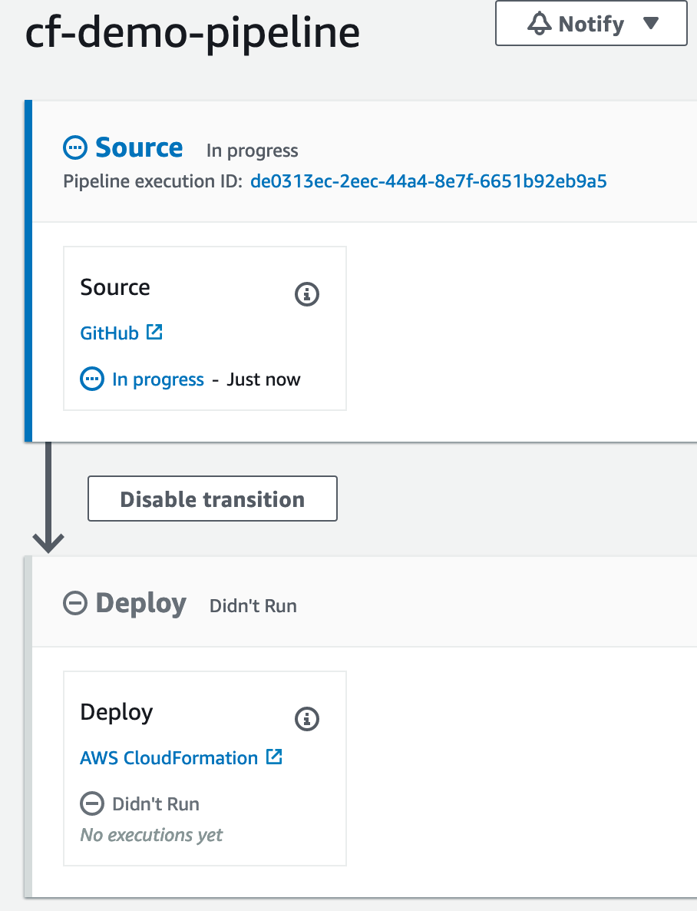
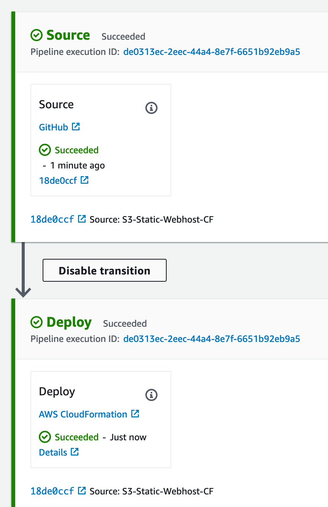

# Infrastructure as Code with AWS CodePipeline

Tutorial တစ်ခုရေးမယ်ဆိုပြီး အလုပ်မအားတာက တကြောင်း .. Project တွေပိနေတာနဲ့ မရေးဖြစ်တာတောင်တော်တော်ကြာသွားပြီ နဂို စာရေးပျင်းတာလည်းပါတာပေါ့။ အခု Project တစ်ခုလုပ်နေရင်း Idea လေးတစ်ခုရတာနဲ့ Infrastructure as Code ကို AWS မှာ Continuous Delivery Pipeline နဲ့လုပ်တာလေးရေးမယ်ဆိုပြီး ဒီ tutorial လေးကိုရေးဖြစ်တာ။ ဆိုတော့ဒီ tutorial လေးကို အစက AWS User Group Myanmar Meetup တွေ Workshop event တွေမှာပြောမယ်ပေါ့.. Covid ဖြစ်သွားတော့ပွဲလည်းအပြင်မှာ မလုပ်ဖြစ်တော့ Online ပွဲမှာ Workshop လုပ်ရတာအားလည်းမရတာနဲ့ စာပဲရေးမယ်ဆိုပြီးဆုံးဖြတ်ဖြစ်သွားတယ်။ ဒီ tutorial မှာ နှစ်ပိုင်းပါမယ် ။ တစ်ပိုင်းက ကျနော် IaC Pipeline ကို AWS CloudFormation and AWS CodePipeline နဲ.အသုံးပြုတာကိုရေးသွားမယ် နောက်တစ်ပိုင်းက ညီလေး ဒီသာထွန်း က သူက Terraform နဲ့ ရေးထားတာရှိတယ်ဆိုတာနဲ့ နှစ်ယောက်ပေါင်းပြီးရေးဖြစ်သွားတယ်ပေါ့။ Terraformကို AWS CodePipeline နဲ့ AWS CloudFormation ကို AWS CodePipeline နဲ့ဆိုပြီးတော့နှစ်ပိုင်းပေါ့။ 

အိုခေ ဒါဆိုနိဒါန်း ချွေနေတာကလည်း တော်တော်များပြီဆိုတော့ ပထမဆုံးအနေနဲ့  Infrastructure as Code \( IaC \) ဆိုတာဘာလဲ? ဘာအတွက်သုံးတာလဲ? ဆိုပြီးမေးခွန်းတွေရှိတယ်။ဆိုတော့ကာ နောက်ပိုင်း DevOps တို. Automation တွေ အလုပ်များလာတာနဲ့အမျှ Infrastructure as Code ကိုနောက်ပိုင်း Organization Infrastructure တွေမှာ အသုံးပြုလာကြပါတယ်။ အရှင်းဆုံးပြောရရင်တော့ Infrastructure as Code ဆိုတာ လက်ရှိကျနော်တို.တွေ manual တည်ဆောက်ကြတဲ့ Infrastructure တွေ Server, Database အစရှိတဲ့ resource တွေကို code နဲ့ automated တည်ဆောက်တာကို ဆိုလိုပါတယ် Cloud Infrastructure မှာဖြစ်ဖြစ် On-Premesis Infrastructure မှာပဲ ဖြစ်ဖြစ်ပေါ့။   
Code နဲ့တည်ဆောက်တယ်ဆိုတာ Programming Code တစ်ခုခု နဲ့ဖြစ်ဖြစ် Configuration Code တွေနဲ့ဖြစ်ဖြစ် တည်ဆောက်နိုင်ပါတယ်။ အထူးသဖြင့် infrastructure orchestration tools တွေဖြစ်တဲ့ Terraform တို. AWS မှာ ဆို AWS CloudFormation တို.ကို အသုံးပြုလေ့ရှိပါတယ်။တခြား Provider တွေက tools တွေလည်းရှိပါတယ်။သေချာလေ့လာပြီး သိချင်ရင်အောက်က လင့်မှာဖတ်နိုင်ပါတယ်။   



[https://blog.newrelic.com/engineering/best-cloud-infrastructure-automation-tools/](https://blog.newrelic.com/engineering/best-cloud-infrastructure-automation-tools/)


အဲ့တော့ Infrastructure ကို Code တွေနဲ့ရေးပြီးတည်ဆောက်မယ် ပြီးတော့ Code Repository ဖြစ်တဲ့ Github မှာတင်လိုက်တာနဲ့ Auto Deploy သွားနိုင်အောင် CI/CD Pipeline တွက် AWS Code Pipeline ကိုအသုံးပြုပြီး Deploy သွားမယ်။ 


[https://aws.amazon.com/codepipeline/](https://aws.amazon.com/codepipeline/)



ကျွန်တော်တိုအပေါ်က Diagram လို Infrastructure as Code တွက် AWS CloudFormation Template ရေးမယ် ပြီးရင် GitHub Repository မှာ Push မယ် Push လိုက်တာနဲ့ တပြိုင်နက် AWS CodePipeline က Trigger မိပြီး Automatically Infrastructure Stacks တွေကို သွားဆောက်မယ် အဲ့လိုဆိုတော့ ကျနော်တို.အရင် ဆုံး AWS CloudFormation Template ရေးဖို.တွက်ကို ကျနော် စလုပ်ပါမယ်။ဒီ tutorial မှာ စမ်းမှာက Amazon S3 Static WebHost Bucket ကို CloudFormation နဲ. auto တည်ဆောက်တဲ့ Template ကို သုံးမှာဖြစ်ပြီး ကိုယ်ကိုတိုင်အသုံးပြုရင်တော့ ကိုယ်ကြိုက်တဲ့ resource ကို CloudFormation နဲ့တည်ဆောက်လို.ရပါတယ် ဥပမာ EC2 တို. RDS တို. VPC  တို.ဆောက်တာပေါ ့။ 

အိုခေ ဒါဆို ပထမဆုံး အနေနဲ့ ကျနော်တို. CloudFormation မလုပ်ခင်အရင်ဆုံး ကျွန်တော်တို. AWS IAM Role တွေတည်ဆောက်ရပါမယ်။ Role ကတော့ **နှစ်ခု** ဆောက်ပေးရပါ။ 

1. CodePipeline IAM Role 
2. CloudFormation IAM Role  ဆိုပြီးတော့ Role နှစ်ခုအရင်ဆောက်ရပါမယ်။ ဒီ လင့်ကနေ policy ကို download လုပ်ပြီးတည်ဆောက်နိုင်ပါတယ်။ 


[https://github.com/phyominhtun1990/cloudformation-codepipeline](https://github.com/phyominhtun1990/cloudformation-codepipeline)


```text
{
    "Statement": [
        {
            "Action": [
                "s3:GetObject",
                "s3:GetObjectVersion",
                "s3:GetBucketVersioning"
            ],
            "Resource": "*",
            "Effect": "Allow"
        },
        {
            "Action": [
                "s3:PutObject"
            ],
            "Resource": [
                "arn:aws:s3:::codepipeline*",
                "arn:aws:s3:::elasticbeanstalk*"
            ],
            "Effect": "Allow"
        },
        {
            "Action": [
                "codecommit:CancelUploadArchive",
                "codecommit:GetBranch",
                "codecommit:GetCommit",
                "codecommit:GetUploadArchiveStatus",
                "codecommit:UploadArchive"
            ],
            "Resource": "*",
            "Effect": "Allow"
        },
        {
            "Action": [
                "codedeploy:CreateDeployment",
                "codedeploy:GetApplicationRevision",
                "codedeploy:GetDeployment",
                "codedeploy:GetDeploymentConfig",
                "codedeploy:RegisterApplicationRevision"
            ],
            "Resource": "*",
            "Effect": "Allow"
        },
        {
            "Action": [
                "elasticbeanstalk:*",
                "ec2:*",
                "elasticloadbalancing:*",
                "autoscaling:*",
                "cloudwatch:*",
                "s3:*",
                "sns:*",
                "cloudformation:*",
                "rds:*",
                "sqs:*",
                "ecs:*",
                "iam:PassRole"
            ],
            "Resource": "*",
            "Effect": "Allow"
        },
        {
            "Action": [
                "lambda:InvokeFunction",
                "lambda:ListFunctions"
            ],
            "Resource": "*",
            "Effect": "Allow"
        },
        {
            "Action": [
                "opsworks:CreateDeployment",
                "opsworks:DescribeApps",
                "opsworks:DescribeCommands",
                "opsworks:DescribeDeployments",
                "opsworks:DescribeInstances",
                "opsworks:DescribeStacks",
                "opsworks:UpdateApp",
                "opsworks:UpdateStack"
            ],
            "Resource": "*",
            "Effect": "Allow"
        },
        {
            "Action": [
                "cloudformation:CreateStack",
                "cloudformation:DeleteStack",
                "cloudformation:DescribeStacks",
                "cloudformation:UpdateStack",
                "cloudformation:CreateChangeSet",
                "cloudformation:DeleteChangeSet",
                "cloudformation:DescribeChangeSet",
                "cloudformation:ExecuteChangeSet",
                "cloudformation:SetStackPolicy",
                "cloudformation:ValidateTemplate",
                "iam:PassRole"
            ],
            "Resource": "*",
            "Effect": "Allow"
        },
        {
            "Action": [
                "codebuild:BatchGetBuilds",
                "codebuild:StartBuild"
            ],
            "Resource": "*",
            "Effect": "Allow"
        },
        {
            "Effect": "Allow",
            "Action": [
                "devicefarm:ListProjects",
                "devicefarm:ListDevicePools",
                "devicefarm:GetRun",
                "devicefarm:GetUpload",
                "devicefarm:CreateUpload",
                "devicefarm:ScheduleRun"
            ],
            "Resource": "*"
        },
        {
            "Effect": "Allow",
            "Action": [
                "servicecatalog:ListProvisioningArtifacts",
                "servicecatalog:CreateProvisioningArtifact",
                "servicecatalog:DescribeProvisioningArtifact",
                "servicecatalog:DeleteProvisioningArtifact",
                "servicecatalog:UpdateProduct"
            ],
            "Resource": "*"
        },
        {
            "Effect": "Allow",
            "Action": [
                "cloudformation:ValidateTemplate"
            ],
            "Resource": "*"
        }
    ],
    "Version": "2012-10-17"
}
```

```text
{
  "Version": "2012-10-17",
  "Statement": [
    {
      "Sid": "",
      "Effect": "Allow",
      "Principal": {
        "Service": "codepipeline.amazonaws.com"
      },
      "Action": "sts:AssumeRole"
    }
  ]
}
```


ပြီးရင်အပေါ်ကပုံအတိုင်းကျနော်တို. IAM Role နှစ်ခုရလာပါလိမ့်မယ်။ပြီးသွားရင်ကျနော်တို.တွေ S3 Static WebHost Bucket တည်ဆောက်တဲ့ AWS CloudFormation Template ကို Github ပေါ်ကိုတင်ပါမယ်။ကျနော်ကတော့တင်ထားပြီးသားဆိုတော့  GitHub ပေါ်မှာရောက်နေပါလိမ့်မယ်။  


```text
## CloudFormation Template Sample - AWS S3 StaticWebHost Bucket

AWSTemplateFormatVersion: 2010-09-09
Resources:
  S3Bucket:
    Type: AWS::S3::Bucket
    Properties:
      AccessControl: PublicRead
      WebsiteConfiguration:
        IndexDocument: index.html
        ErrorDocument: error.html
  BucketPolicy:
    Type: AWS::S3::BucketPolicy
    Properties:
      PolicyDocument:
        Id: Mys3bucketPolicy
        Version: 2012-10-17
        Statement:
          - Sid: PublicReadForGetBucketObjects
            Effect: Allow
            Principal: '*'
            Action: 's3:GetObject'
            Resource: !Join 
              - ''
              - - 'arn:aws:s3:::'
                - !Ref S3Bucket
                - /*
      Bucket: !Ref S3Bucket
Outputs:
  WebsiteURL:
    Value: !GetAtt 
      - S3Bucket
      - WebsiteURL
    Description: URL for website hosted on S3
  S3BucketSecureURL:
    Value: !Join 
      - ''
      - - 'https://'
        - !GetAtt 
          - S3Bucket
          - DomainName
    Description: Name of S3 bucket to hold website content
```

ဒီလိုရောက်နေပြီဆိုရင် ကျွန်တော်တို. AWS Management Console ကနေ AWS CodePipeline ကိုတည်ဆောက်ပါမယ်။ ပြီးရင်ကျနော်တို. AWS CodePipeline နဲ့ Github နဲ့ကို ချိတ်ပါမယ်။   
အရင်ဆုံး AWS Console ကနေ CodePipeline Service ကိုသွားမယ်။ ပြီးရင် Create Pipeline ဆိုပြီး  Pipeline အသစ်တစ်ခုဆောက်မယ်။ 

အဲ့ဒီမှာ Role နေရာမှာ Existing service role ကိုရွေးချယ်ပြီး အပေါ်မှာတည်ဆောက်ထားတဲ့ IAM Role နှစ်ခုထဲက CodePipeline IAM Service Role ကို ရွေးထည့်ပေးရပါမယ်။ 


ပြီးသွားရင် Add Source Stage မှာ GitHub Repo နဲ့ချိတ်ပေးရပါမယ်။ချိတ်ဆက်ပြီးသွားရင်တော့ ကိုယ့် Github Repo တွေကိုတွေ.ရပါမယ်။ အဲ့ကနေမှာ ခုနက ကိုယ် CloudFormation Template store ထားတဲ့ Repo ကို ရွေးချယ်ပြီး  Webhooks တည်ဆောက်ပေးရပါမယ်။ 


ပြီးရင် Build Stage ကို ကျော်မယ်။ ထို.နောက် Deployment Provider ကို AWS CloudFormation ရွေးပေးပြီး Artifact name မှာ SourceArtifact နှင့် File name မှာ AWS CloudFormation Template name ကို ထည့်ပေးရပါမယ်။ Role Name မှာတော့ အပေါ်ကတည်ဆောက်ခဲ့သော IAM Role နှစ်ခုထဲက CloudFormation Role ကို ရွေးချယ်ပေးရပါမယ်။ 


ပြီးတာနဲ့တပြိုင်နက်ထဲ AWS CodePipeline က ချက်ချင်းကို အောက်ကပုံပါအတိုင်း စပြီး Source Repo ကနေဆွဲချပြီး Deployment Process ကို စတင်ပါတော့တယ်။ 





အပေါ်ကပုံအတိုင်း အားလုံး အိုကေတယ်ဆိုရင် Deployment Success ဖြစ်သွားတာပေါ့။ ဒါဆိုရင်ကျွန်တော်တို.တွေ AWS CloudFormation Console ကိုသွားပြီး ကြည့်ရအောင်။ 


အိုကေ...ဒါဆိုကျွန်တော်တို. CodePipeline ကနေ CloudFormation ကို Deploy လုပ်ပြီးတော့ S3 Static WebHost လုပ်ဖို.အတွက် Bucket ကို CloudFormation Template နဲ့ တည်ဆောက်ပြီးဖြစ်ပါတယ်။ 


ဒါဆိုကျွန်တော်တို. CodePipeline ကနေဆောက်ထားတဲ့ Bucket မှာ Web data တင်ပြီးတော့ Static Website တစ်ခု run လို.ရပါပြီ။ နောက်တစ်ပိုင်းကတော့ ကျွန်တော် ညီလေး ဒီသာထွန်းရဲ့ Terraform နဲ့ Pipeline တည်ဆောက်တာကိုဆက်ရေးသွားမှာဖြစ်ပါတယ်။ အောက်တွင်ဆက်လက်ဖတ်ရှုပေးကြပါရန် ။။ 

